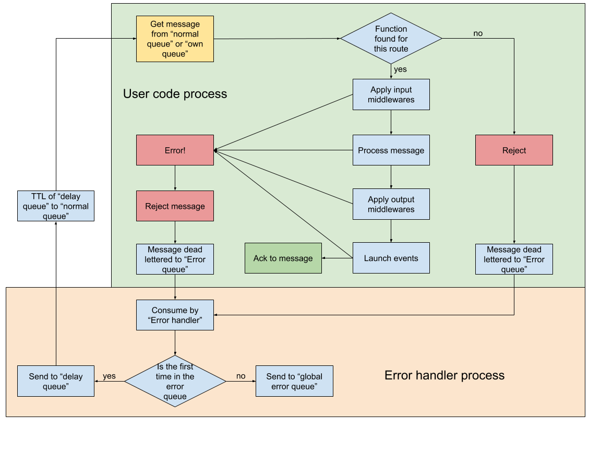

# Service framework

<!-- MarkdownTOC autolink=true autoanchor=true bracket=round depth=0 -->

- [Introduction](#introduction)
- [Responsibilities](#responsibilities)
- [Conceptual Structure](#conceptual-structure)
    - [Normal Queue](#normal-queue)
    - [Own Queue](#own-queue)
    - [Delay Queue](#delay-queue)
    - [Error Queue](#error-queue)
    - [Global Error Queue](#global-error-queue)
    - [Normal Exchange](#normal-exchange)
    - [Normal Exchange Republish](#normal-exchange-republish)
    - [Error Exchange](#error-exchange)
    - [Delay Exchange](#delay-exchange)
    - [Service Process](#service-process)
    - [Error Process](#error-process)
        - [Message Consumption](#message-consumption)
- [Technical Structure](#technical-structure)
    - [API](#api)
        - [`ServiceClass.start\(\[config\]\)`](#serviceclassstartconfig)
        - [`ServiceInstance.on\(serviceName, route, callback\)`](#serviceinstanceonservicename-route-callback)
        - [`ServiceInstance.off\(serviceName, route, callback\)`](#serviceinstanceoffservicename-route-callback)
        - [`ServiceInstance.middleware\(callback, \[isPostMiddleware\]\)`](#serviceinstancemiddlewarecallback-ispostmiddleware)
        - [`ServiceInstance.instanceOn\(serviceName, route, callback\)`](#serviceinstanceinstanceonservicename-route-callback)
        - [`ServiceInstance.instanceOff\(serviceName, route, callback\)`](#serviceinstanceinstanceoffservicename-route-callback)
    - [Technical details](#technical-details)
        - [Routing messages internally](#routing-messages-internally)
        - [ACK on the correct moment](#ack-on-the-correct-moment)
        - [AMQP reconnection](#amqp-reconnection)
        - [Pause, resume and exiting normally](#pause-resume-and-exiting-normally)
    - [Planning](#planning)
    - [Servers configuration](#servers-configuration)
        - [Configure rabbitmq servers](#configure-rabbitmq-servers)
        - [Configure balancer server](#configure-balancer-server)

<!-- /MarkdownTOC -->

<a name="introduction"></a>
# Introduction

This document defines the service framework. This is a framework that handles all the communication between the services of Omnea inside of and AMQP net.

The framework makes easy adding new logic to the code without worry about the complexities of AMQP and distributed services.

<a name="responsibilities"></a>
# Responsibilities

The framework handles:

* Communication between services
    * Send events
    * RPC
* Error handling (retry and send to global error queue for registering an unrecoverable error)
* Routing and processing of the messages by the developer code
* Acknowledgment/rejection of the messages after processing
* Middlewares for before and after processing
* Queue/Exchange infrastructure declaration for the service
* Service error recovery (reconnection)
The framework will ensure that no message is lost and the logic will work correctly if all this conditions are satisfied:
* The messages are idempotent
* The developer code tells in the correct moment when is finish of processing the message (make all the queries, communicate with external services, and other tasks)
* The queue system has enough ram and resources for handling all the messages

<a name="conceptual-structure"></a>
# Conceptual Structure

The framework defined the entity "Service". A service is a set of queues and exchanges and processes that work together for receiving and sending messages in a safe way ensuring at least one delivery.


<a name="normal-queue"></a>
## Normal Queue

It have all the bindings with other services. All the normal communication between services goes through this queue. When a subscriptions to a queue is declared, a new binding is done in this queue. The bindings are dynamically declared and undeclared over the queue. This queue dead letters to the **error queue**.

* Durable: true
* Exclusive: false
* Auto-delete: false
* Max-capacity: 10000

<a name="own-queue"></a>
## Own Queue

Behaves as the **normal queue** but is associated with the concrete instance of the service. That means that every process will have a queue and when the process dies, the queue will be deleted. 

* Durable: true
* Exclusive: true
* Auto-delete: false
* Max-capacity: 10000

<a name="delay-queue"></a>
## Delay Queue

The only purpose of this queue is to insert a delay before the requeued messages enter in the **normal queue**.

* Durable: true
* Exclusive: false
* Auto-delete: false
* Ttl: 5 seconds

<a name="error-queue"></a>
## Error Queue

This queue receives all the rejections, the timeouts and max capacity dead lettering of the **normal queue**. This queue is durable and not exclusive. This queue deadletters to **global error queue**.

* Durable: true
* Exclusive: false
* Auto-delete: false
* Max-capacity: 10000

<a name="global-error-queue"></a>
## Global Error Queue

This queue is global and there is only one in all the rabbitmq cluster. If an error is retried several times or the **error queue **reach their maximum capacity the messages are sent to this queue for store and analyzing. 

* Durable: true
* Exclusive: false
* Auto-delete: false

<a name="normal-exchange"></a>
## Normal Exchange

All services have an exchange with the name of the service. The events of the service are published in this exchange. If other service wants to listen from this service, it must subscribe in this exchange.

Now every service have its own exchange. That means that we can’t have several services publishing in the same exchange. Maybe in the future this can be an option for moving from services to microservices, but not for now.

<a name="normal-exchange-republish"></a>
## Normal Exchange Republish

Delay queue death letter to this exchange. This exchange moves all messages to the normal queue, independent of if the message was in the normal queue or the own queue. That means that the routes between own queue and normal queue are shared, making impossible to add the same route to both queues. 

<a name="error-exchange"></a>
## Error Exchange

This exchange receives all the messages rejected from the **normal queue** and **own queue**. It sends the all messages to the **error queue**. This exchange is of type **fanout** that means that every message is delivered to all subscripted queues maintaining all the message’s data, in this case, only the **error queue**. 

<a name="delay-exchange"></a>
## Delay Exchange

This exchange receives the messages that need to be requeued from the **error process**. It sends all the messages to the delay queue. Is a **fanout** exchange too.

<a name="service-process"></a>
## Service Process

This is the part that abstracts the developer from the complexities of the AMQP system.

Here is where the queues and exchanges are declared and launched. This Process consumes the messages in the **normal queue** and the **own queue**. It contains the application itself.

<a name="error-process"></a>
## Error Process

This is a parallel process that and consumes the messages in the **error queue**. It decides when to requeue a message and when to send a message to the **global error queue**.

<a name="message-consumption"></a>
### Message Consumption



<a name="technical-structure"></a>
# Technical Structure

The structure of the framework try to be as standalone and simple as possible (small in code and low dependencies). It provides an API for subscribe to messages and for emitting other messages. 

<a name="api"></a>
## API

The service API is very simple:

```javascript
var error = require('debug')('Omnea:SF:error');

var Service = require('@Omneagmbh/service-framework');

Service.start()
.catch(error)
.then(service => {
    service.on('service-name', 'route.to.service', log)
    .catch(err => {error('Error adding route', err);});
});
```

<a name="serviceclassstartconfig"></a>
### `ServiceClass.start([config])`

This method creates the instance, connects with the server, declare all the queues, exchanges and bindings and gives the instance ready for use. It returns a promise that is satisfied with the instance and reject the promise if any error occurs.

<a name="serviceinstanceonservicename-route-callback"></a>
### `ServiceInstance.on(serviceName, route, callback)`

This method adds a subscription to one service on one route. 

The routes accept patterns like` *.orange.*`,  `*.*.rabbit` and `lazy.#`.

* `*` (star) can substitute for exactly one word.
* `#` (hash) can substitute for zero or more words.

The route is created by adding a binding the **normal queue** to the exchange and route that is provided. Remember that the **normal exchange** has the same name that the service, that means that doing something like: 

```javascript
    service.on('submitter', 'submitted.success.#', callback);
```

Is binding the **normal queue** to the exchange `submitter` with the route `submitted.success.#`. Note: The **normal exchange** is always type topic. 

When a consumed message satisfies the service and route, the callback is called. Only one callback will be called, no matter how many callbacks matches with the message service and route. (This can be changed in the future, but for maintain it simple, only one callback. The reason is to not fail to ensure that all callbacks finish before making the ack, with one callback is simple and less error prone)

<a name="serviceinstanceoffservicename-route-callback"></a>
### `ServiceInstance.off(serviceName, route, callback)`

Delete the binding of the queue and delete the callback from the internal states. If the queue still has messages with this service and route and any other route can process this message, the message is discarded and sent to the global error queue.

<a name="serviceinstancemiddlewarecallback-ispostmiddleware"></a>
### `ServiceInstance.middleware(callback, [isPostMiddleware])`

Add a middleware that will be applied to all messages. The middleware must return a promise. 

If the second argument is set, the middleware is configured for executing after the message process.

<a name="serviceinstanceinstanceonservicename-route-callback"></a>
### `ServiceInstance.instanceOn(serviceName, route, callback)`

Works exactly like `on` method, but makes the binding in the **own queue** instead of the **normal queue**. 

Note: Internally the routes are shared between `on` and `instanceOn`. That means that a route of one can match a message of the other. Take care of that.

<a name="serviceinstanceinstanceoffservicename-route-callback"></a>
### `ServiceInstance.instanceOff(serviceName, route, callback)`

Works exactly like `off` method, but removes the binding in the **own queue** instead of the **normal queue**. 

<a name="technical-details"></a>
## Technical details

<a name="routing-messages-internally"></a>
### Routing messages internally

The messages are always consumed from the **normal queue** and **own queue**. The bindings of this queue are changed dynamically for reflecting the subscriptions of the service. 

When a message is received, the exchange name and the route are matched with **one** callback. This callback is the function that the developer provides on the **service.on()** method.

For routing the pattern system of the RabbitMQ topic exchange are recreated on the code.

If a message has more than one callback, only the first specified callback by the developer is chosen for processing the message.

<a name="ack-on-the-correct-moment"></a>
### ACK on the correct moment

The acknowledgment of the message is done **after all dev code actions are done**. The callback provided by the developer must return a Promise that is satisfied **only when all sync/async action are finish**. 

If the promise is rejected, the message will be rejected and reprocess one more time (by the same or other process in the service cluster).

The framework can use other system for checking if some action is performed after the promise is satisfied ([https://github.com/strongloop/zone](https://github.com/strongloop/zone)). In that case and Error will be launch and the process will be **exited normally**. That must be understand as the service rejecting to operate with this kind of bug.

<a name="amqp-reconnection"></a>
### AMQP reconnection

If the connection is lost, the process stop itself and do a normal exit expecting the supervisor to relaunch the process for doing a new connection. This is done because once a connection is lost, all processed messages must be reprocessed.

<a name="pause-resume-and-exiting-normally"></a>
### Pause, resume and exiting normally

The service can stop and resume their activity. We have a normal exit when the process is close when stopped. 

* For stopping, the service will:
    * Stop consumption
    * Wait for all consumed messages for finish their process
    * Send all the events of all the messages
    * Log their stop
* For starting (after stopping)
    * Start the consumption
* For normal exiting
    * Stop the process
    * Log the process as **normally exit**
    * Close all the channels
    * Close the process

<a name="planning"></a>
## Planning

* V0.x
    * AMQP ✓
    * Event ✓
    * Middlewares ✓
* V1.0
    * Error handling ✓
    * Queues creation (configuration of the service) ✓
    * Reconnection/Recovery ✓
    * RPC

<a name="servers-configuration"></a>
## Servers configuration

<a name="configure-rabbitmq-servers"></a>
### Configure rabbitmq servers

1. Give a consistent hostname for the server (i.e. for the cluster rabbitmq-n)
    * set hostname
`sudo hostname rabbitmq-1`
    * change it in next files
`/etc/hostname/`
`/etc/hosts`
2. Install rabbitmq ([debian docs](https://www.rabbitmq.com/install-debian.html))
    * add repo
`echo 'deb http://www.rabbitmq.com/debian/ testing main' | sudo tee /etc/apt/sources.list.d/rabbitmq.list`
    * add key
`wget -O- https://www.rabbitmq.com/rabbitmq-release-signing-key.asc | sudo apt-key add -`
    * update pkg list
`sudo aptitude update`
    * install rabbitmq-server
`sudo aptitude install rabbitmq-server`
3. Configure rabbitmq ([Production Checklist](https://www.rabbitmq.com/production-checklist.html))
    * for example create custom config file (`/etc/rabbitmq/rabbitmq.config`) and configure RAM limits
`[{rabbit, [{vm_memory_high_watermark, 0.9}]}]`.
4. Configure cluster ([Clustering Guide](http://www.rabbitmq.com/clustering.html))
    * general
        * hostnames of all cluster members must be resolvable from all cluster nodes (through DNS records or Local host files (`/etc/hosts`))
        * copy cookie (`/var/lib/rabbitmq/.erlang.cookie`) from master to another nodes (in order to communicate between them)
    * for the master
        * create new user in rabbit:
`sudo rabbitmqctl add_user test test`
`sudo rabbitmqctl set_user_tags test administrator`
`sudo rabbitmqctl set_permissions -p / test ".*" ".*" ".*"`
        * enable management plugin (for the web interface, default on the port 15672)
`sudo rabbitmq-plugins enable rabbitmq_management`
        * call cluster status
`sudo rabbitmqctl cluster_status`
        * describe HA queues ([Highly Available Queues](https://www.rabbitmq.com/ha.html)). For example:
`rabbitmqctl set_policy HA ".*" '{"ha-mode": "all"}'`
    * for the other nodes:
        * enable management agent plugin
`sudo rabbitmq-plugins enable rabbitmq_management_agent`
        * join to the cluster sudo rabbitmqctl cluster_status
`sudo rabbitmqctl stop_app`
`sudo rabbitmqctl join_cluster rabbit@rabbitmq-1`
`sudo rabbitmqctl start_app`
        * where "rabbit@rabbitmq-1" is a “user@hostname” of existing member of cluster (for example master)
5. Security
    * rabbitmq ports (5672 and 15672 on the server with web-interface) must be accessible between all nodes (including balancer);
    * port for the ssh must be opened if required.

<a name="configure-balancer-server"></a>
### Configure balancer server

1. Hostnames
    * set hostname
sudo hostname rabbitmq-balancer
    * change it in next files
`/etc/hostname/`
`/etc/hosts`
    * hostnames of all cluster members must be resolvable from balancer (or need refers by ip in config)
2. Install HAProxy
    * Install stable version for Ubuntu ([or follow by official site](http://haproxy.debian.net/))
`sudo aptitude update`
`sudo aptitude install haproxy`
3. Configure HAProxy
    * Add to configuration file (`/etc/haproxy/haproxy.cfg`)

```
listen rabbitmq
    bind *:5672
    mode tcp
    log global
    retries 3
    option tcplog
    option persist
    balance leastconn
    server rabbitmq-1 rabbitmq-1:5672 check inter 5s rise 2 fall 3
    ...
    server rabbitmq-n rabbitmq-n:5672 check inter 5s rise 2 fall 3
listen rabbitmq-management
    bind *:15672
    mode http
    server rabbitmq-1 rabbitmq-1:15672
```
    * section "rabbitmq-management" refers to the node with web interface

4. Security
    * all proxying ports (5672 and 15672) must be opened (for external connects);
    * port for t
    * he ssh must be opened if required.

